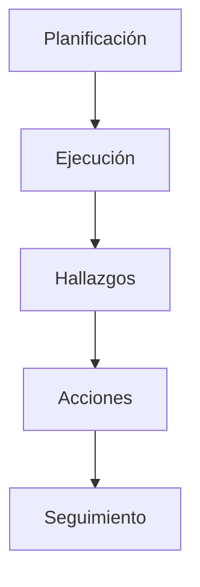
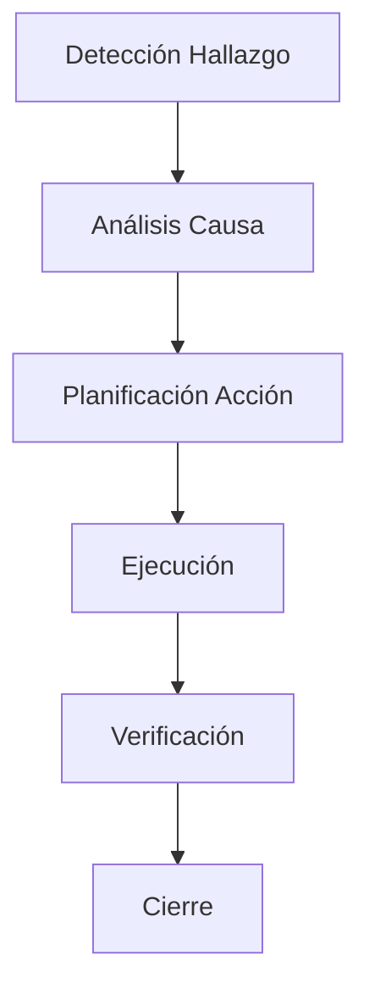
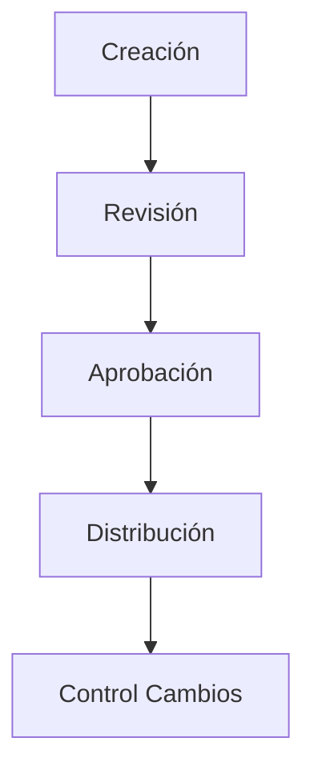

# 📋 Estructura del Sistema IsoFlow3 - Organización por Funcionalidad

## 🎯 Resumen Ejecutivo
Este documento presenta la organización completa del sistema IsoFlow3, desde la interfaz de usuario hasta la base de datos, estructurado por funcionalidades del sistema de gestión de calidad ISO.

---

## 📊 Tabla de Organización Funcional

| **ABM/Funcionalidad** | **Archivos del Frontend** | **Archivos del Backend** | **Tablas de BD** |
|----------------------|---------------------------|--------------------------|------------------|
| **🏢 Departamentos** | `components/departamentos/`<br/>- DepartamentoModal.jsx<br/>- DepartamentoSingle.jsx<br/>- DepartamentosListing.jsx | `routes/departamentos.routes.js`<br/>`controllers/departamentos.controller.js` | `departamentos` |
| **👤 Personal** | `components/personal/`<br/>- PersonalModal.jsx<br/>- PersonalSingle.jsx<br/>- PersonalListing.jsx<br/>- PersonalCard.jsx<br/>- PersonalTableView.jsx | `routes/personal.routes.js`<br/>`controllers/personal.controller.js` | `personal` |
| **💼 Puestos** | `components/puestos/`<br/>- PuestoModal.jsx<br/>- PuestoSingle.jsx<br/>- PuestosListing.jsx<br/>- PuestoCard.jsx | `routes/puestos.routes.js`<br/>`controllers/puestos.controller.js` | `puestos` |
| **📚 Evaluación de Personal** | `components/Evaluacionesdepersonal/`<br/>- EvaluacionModal.jsx<br/>- EvaluacionSingle.jsx<br/>- EvaluacionesListing.jsx | `routes/evaluaciones-grupales.routes.js`<br/>`controllers/evaluaciones.controller.js` | `evaluaciones`<br/>`evaluaciones_grupales` |
| **⚙️ Procesos** | `components/procesos/`<br/>- ProcesoModal.jsx<br/>- ProcesoSingle.jsx<br/>- ProcesosListing.jsx | `routes/procesos.routes.js`<br/>`controllers/procesos.controller.js` | `procesos` |
| **🎯 Objetivos de Calidad** | `components/procesos/`<br/>- ObjetivoModal.jsx<br/>- ObjetivoSingle.jsx<br/>- ObjetivosListing.jsx | `routes/objetivos_calidad.routes.js`<br/>`controllers/objetivos.controller.js` | `objetivos_calidad` |
| **📊 Indicadores de Calidad** | `components/procesos/`<br/>- IndicadorModal.jsx<br/>- IndicadorSingle.jsx<br/>- IndicadoresListing.jsx | `routes/indicadores.routes.js`<br/>`controllers/indicadores.controller.js` | `indicadores` |
| **📈 Mediciones** | `components/procesos/`<br/>- MedicionModal.jsx<br/>- MedicionSingle.jsx<br/>- MedicionesListing.jsx | `routes/mediciones.routes.js`<br/>`controllers/mediciones.controller.js` | `mediciones` |
| **📄 Documentos** | `components/documentos/`<br/>- DocumentoModal.jsx<br/>- DocumentoSingle.jsx<br/>- DocumentosListing.jsx<br/>- DocumentViewer.jsx | `routes/documentos.routes.js`<br/>`controllers/documentos.controller.js` | `documentos` |
| **📋 Normas** | `components/normas/`<br/>- NormaSingle.jsx<br/>- NormaSingleView.jsx<br/>- NormasList.jsx | `routes/normas.routes.js`<br/>`controllers/normas.controller.js` | `normas` |
| **🔍 Hallazgos** | `components/hallazgos/`<br/>- HallazgoForm.jsx<br/>- HallazgoSingle.jsx<br/>- HallazgoKanbanBoard.jsx<br/>- HallazgoWorkflowManager.jsx | `routes/mejoras.routes.js`<br/>`controllers/hallazgos.controller.js` | `hallazgos` |
| **🚀 Acciones de Mejora** | `components/acciones/`<br/>- AccionFormModal.jsx<br/>- AccionSingle.jsx<br/>- AccionKanbanBoard.jsx<br/>- AccionWorkflowManager.jsx | `routes/acciones.routes.js`<br/>`controllers/acciones.controller.js` | `acciones` |
| **🔍 Auditorías** | `components/auditorias/`<br/>- AuditoriaModal.jsx<br/>- AuditoriaSingle.jsx<br/>- AuditoriasList.jsx<br/>- AuditoriasListing.jsx | `routes/auditorias.routes.js`<br/>`controllers/auditorias.controller.js` | `auditorias`<br/>`auditoria_procesos`<br/>`auditoria_hallazgos`<br/>`auditoria_participantes`<br/>`auditoria_evidencias` |
| **🎓 Capacitaciones** | `components/capacitaciones/`<br/>- CapacitacionModal.jsx<br/>- CapacitacionSingle.jsx<br/>- CapacitacionesListing.jsx<br/>- CapacitacionKanbanBoard.jsx | `routes/capacitaciones.routes.js`<br/>`controllers/capacitaciones.controller.js` | `capacitaciones` |
| **🏆 Competencias** | `components/competencias/`<br/>- CompetenciaModal.jsx<br/>- CompetenciasListing.jsx<br/>- EvaluacionCompetenciaModal.jsx | `routes/competencias.routes.js`<br/>`routes/evaluaciones-competencias.routes.js` | `competencias`<br/>`evaluaciones_competencias` |
| **📦 Productos** | `components/productos/`<br/>- ProductoModal.jsx<br/>- ProductoSingle.jsx<br/>- ProductosListing.jsx | `routes/productos.routes.js`<br/>`controllers/productos.controller.js` | `productos` |
| **📋 Encuestas** | `components/encuestas/`<br/>- EncuestaModal.jsx<br/>- EncuestasListing.jsx<br/>- ResponderEncuesta.jsx | `routes/encuestas.routes.js`<br/>`controllers/encuestas.controller.js` | `encuestas` |
| **🎫 Tickets** | `components/tickets/`<br/>- TicketModal.jsx<br/>- TicketSingle.jsx<br/>- TicketsListing.jsx | `routes/tickets.routes.js`<br/>`controllers/tickets.controller.js` | `tickets` |

---

## 🏗️ Arquitectura del Sistema

### 🎨 Frontend (React + Vite)
```
frontend/
├── src/
│   ├── components/          # Componentes organizados por funcionalidad
│   │   ├── auditorias/     # Gestión de auditorías
│   │   ├── capacitaciones/ # Gestión de capacitaciones
│   │   ├── competencias/   # Evaluación de competencias
│   │   ├── departamentos/  # Gestión organizacional
│   │   ├── documentos/     # Control documental
│   │   ├── hallazgos/      # Gestión de no conformidades
│   │   ├── personal/       # Recursos humanos
│   │   ├── procesos/       # Gestión de procesos
│   │   └── ...
│   ├── pages/              # Páginas principales
│   ├── services/           # Servicios API
│   ├── hooks/              # Hooks personalizados
│   └── utils/              # Utilidades
```

### ⚙️ Backend (Node.js + Express)
```
backend/
├── routes/                 # Rutas API organizadas por funcionalidad
│   ├── auditorias.routes.js
│   ├── capacitaciones.routes.js
│   ├── competencias.routes.js
│   └── ...
├── controllers/            # Lógica de negocio
├── services/              # Servicios de datos
├── middleware/            # Middleware personalizado
└── scripts/               # Scripts de inicialización
```

### 🗄️ Base de Datos (SQLite/Turso)
```sql
-- Tablas principales del sistema
auditorias                 -- Gestión de auditorías internas/externas
├── auditoria_procesos     -- Procesos auditados
├── auditoria_hallazgos    -- Hallazgos de auditoría
├── auditoria_participantes -- Equipo auditor
└── auditoria_evidencias   -- Evidencias documentales

hallazgos                  -- No conformidades y oportunidades
acciones                   -- Acciones correctivas/preventivas
procesos                   -- Mapa de procesos
personal                   -- Recursos humanos
departamentos              -- Estructura organizacional
```

---

## 🔄 Flujos de Trabajo Principales

### 1. 🔍 Gestión de Auditorías


### 2. 🚀 Mejora Continua


### 3. 📚 Gestión Documental


---

## 🎯 Módulos Especializados

### 📊 Dashboard Central
- **Frontend**: `components/dashboard/DashboardCentral.jsx`
- **Paneles**: Auditorías, Calidad, Cumplimiento, Procesos
- **Métricas**: KPIs en tiempo real

### 🤖 Asistente IA
- **Frontend**: `components/assistant/IsoAssistant.jsx`
- **Funciones**: Análisis documental, recomendaciones ISO
- **Integración**: OpenAI API

### 📅 Gestión de Eventos
- **Frontend**: `components/calendar/CalendarView.jsx`
- **Backend**: `routes/eventRoutes.js`
- **Funcionalidad**: Programación auditorías, capacitaciones

### 🔔 Notificaciones
- **Frontend**: `components/notifications/NotificationCenter.jsx`
- **Backend**: `services/emailService.js`
- **Canales**: Email, sistema interno

---

## 🛠️ Tecnologías Utilizadas

### Frontend
- **React 18** - Framework principal
- **Vite** - Build tool y dev server
- **TailwindCSS** - Estilos y diseño
- **Framer Motion** - Animaciones
- **React Hook Form** - Gestión de formularios
- **Zustand** - Estado global
- **React Router** - Navegación

### Backend
- **Node.js** - Runtime
- **Express.js** - Framework web
- **Turso/SQLite** - Base de datos
- **JWT** - Autenticación
- **Multer** - Upload de archivos
- **Socket.io** - Comunicación en tiempo real

### Base de Datos
- **SQLite** - Base de datos local
- **Turso** - Base de datos distribuida
- **Índices optimizados** - Performance

---

## 📈 Métricas y Monitoreo

### KPIs del Sistema
- ✅ Conformidad de procesos
- 📊 Eficacia de acciones
- ⏱️ Tiempos de respuesta
- 👥 Participación del personal
- 📋 Cumplimiento normativo

### Reportes Disponibles
- 📊 Dashboard ejecutivo
- 📈 Tendencias de calidad
- 🔍 Estado de auditorías
- 🚀 Seguimiento de mejoras
- 📚 Control documental

---

## 🔐 Seguridad y Accesos

### Roles del Sistema
- **👑 Super Admin** - Acceso total
- **🏢 Admin Organización** - Gestión completa
- **👤 Usuario Estándar** - Operaciones básicas
- **👁️ Solo Lectura** - Consulta únicamente

### Funcionalidades de Seguridad
- 🔐 Autenticación JWT
- 🛡️ Autorización por roles
- 📝 Auditoría de acciones
- 🔒 Encriptación de datos
- 🚫 Validación de entrada

---

*📅 Última actualización: Enero 2025*
*🏷️ Versión del sistema: IsoFlow3*